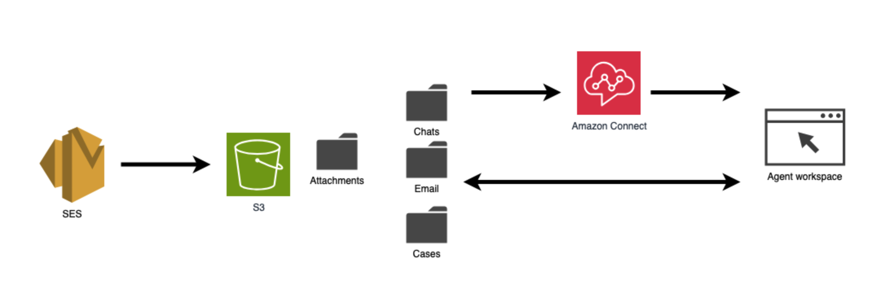
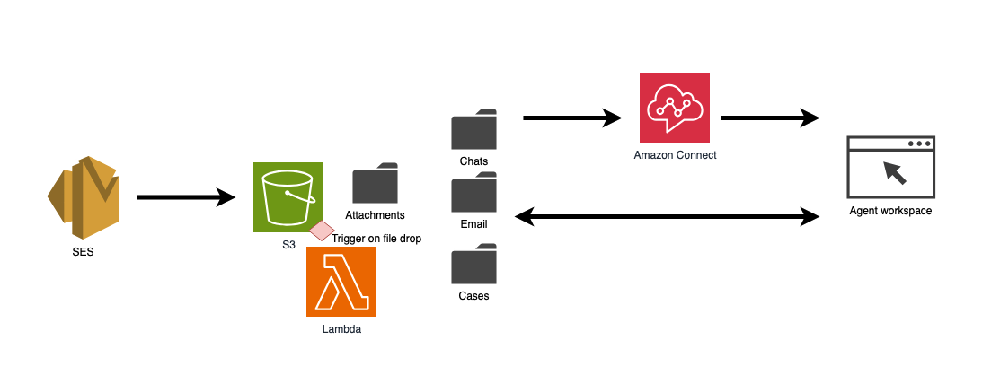

# Amazon Connect Attachment Preview

## Problem Statement

Attachments exchanged via Amazon Connect—whether sent by customers or agents—are stored securely in an S3 bucket. Traditionally, when agents access these files through the Contact Control Panel (CCP) or Agent Workspace, clicking a file opens it in a new browser tab and automatically downloads it to the agent’s device.

For organizations seeking to prevent automatic downloads of attachments from email, chat, or case interactions, this solution enables agents to preview attachments directly within the browser. Downloads only occur if the agent chooses to do so, requiring a deliberate, manual action. This approach helps maintain data security by reducing the risk of sensitive files being stored locally on agent devices, while still allowing access to attachments when necessary.

## Solution Overview

Chromium-based browsers natively support in-browser previewing of PDF, JPG, and PNG files. This functionality is enabled when the appropriate "Content-Type" metadata is set in S3, ensuring that files stored as attachments are correctly recognised and displayed by the browser.

Amazon SES stores email and chat attachments in S3, organizing them into separate folder structures based on the communication channel. Amazon Connect then routes these interactions according to contact flow logic, ultimately assigning them to an agent in the Agent Workspace. Agents can access the attachments directly through the Agent Workspace interface.

To address this issue, a Lambda function is triggered by updates to specific folders in the S3 bucket. The Lambda checks the file type, creates a copy of the file with updated metadata headers, and then deletes the original version. This process ensures that when agents open the file, it launches in a new browser tab for preview, rather than being downloaded.

## Implementation

1. Deploy the attached Lambda in your AWS Account where Amazon Connect instance is.
2. Configure the Lambda function to be triggered by updates to files in the S3 bucket. This can be set up to monitor specific folders for chat, email, or case attachments, or at the parent folder level to cover all three scenarios.

## Browsers Tested
- Chrome 135.0.7049.85
- Firefox 137.0
- Edge Version 135.0.3179.73

## Costing
Due to the lightweight design of the Lambda function and its brief execution time, costs are anticipated to be minimal and will remain within the Lambda free tier.
